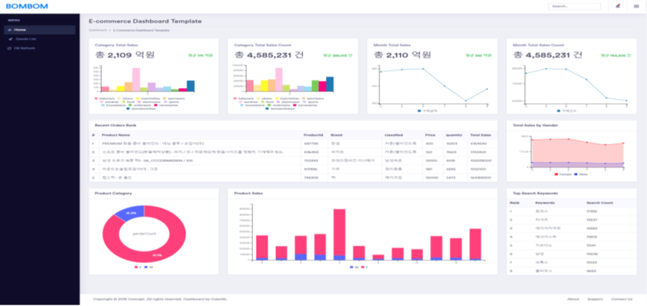
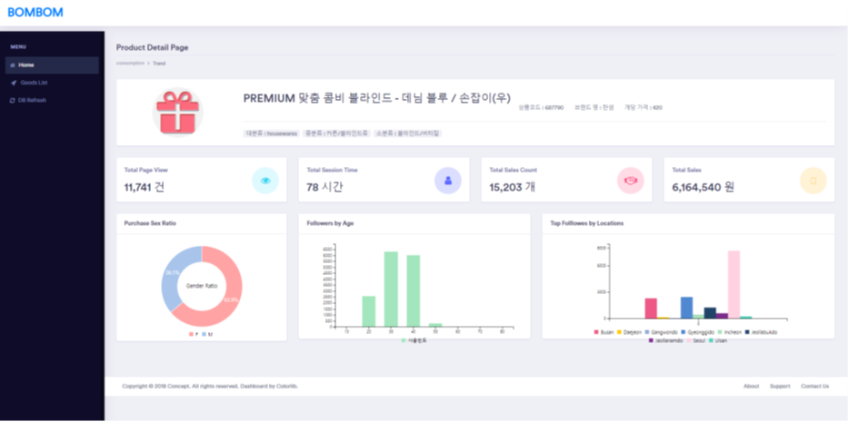
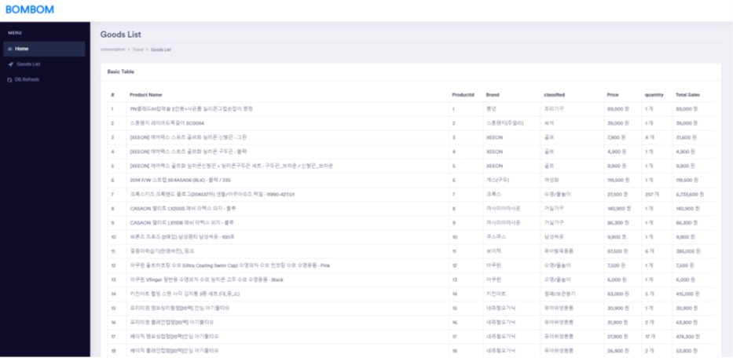
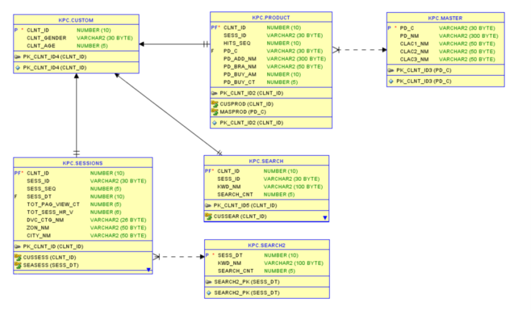

# SCM Admin 플랫폼 BOM

<b>온라인 마켓 SCM Admin 통계 플랫폼</b>

 
2020.07.27 개발 시작 2020.08.10 개발 완료

# 구현체
<ul>
    <li>Spring Batch를 통한 스케줄링 개발.</li>
    <li>롯데 L.Point 소비자 데이터 전처리.</li>
    <li>Oracle 기반 DB 설계 및 ERD 작성.</li>
    <li>C3 Chart 기반 통계 그래프 개발.</li>
</ul>

# 기술 스택
<ul>
    <li>Java</li>
    <li>Spring MVC</li>
    <li>JSP & AJAX</li>
    <li>MyBatis & Oracle</li>
    <li>HTML5 & CSS3 & Bootstrap</li>
</ul>
